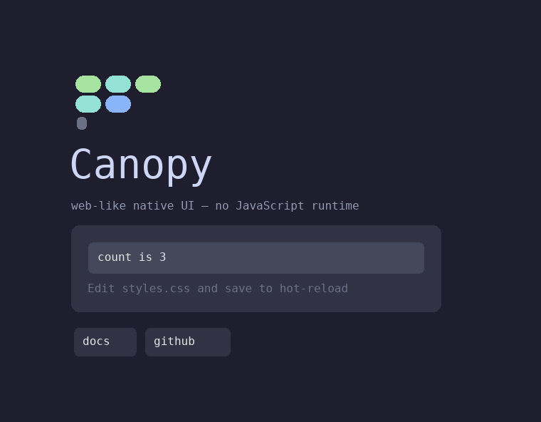

# Canopy

**A JavaScript-runtime-free, web-like native UI runtime.**

Canopy lets you author a UI with the web mental model you already know — a declarative
tree, CSS-like styling, components, signal reactivity — but **there is no JavaScript
runtime**. Your app logic is native Rust (or WebAssembly), and it never touches a "DOM"
directly. Instead it reaches the UI only through a **typed, capability-based op-stream**:
every UI node is an opaque, **unforgeable handle**, and the only thing a guest can do is
hand the host a validated batch of ops. That one property does double duty — the
DOM-access boundary *is* the plugin-permission boundary. A guest can mutate exactly the
nodes it was handed and nothing else.

The result is a lightweight Electron/Tauri alternative whose core is `no_std` + `alloc`,
so the same UI code embeds all the way down toward bare metal: rich GPU rendering on the
desktop today, with a clean seam to a software rasterizer for constrained targets.



---

## Quick start

Canopy ships a `canopy` CLI (the `canopy-cli` crate) that scaffolds a starter app — the
JSX **welcome screen** above, Canopy's answer to `npm create vite`:

```sh
# Build/install the CLI from a checkout, then:
canopy new myapp
cd myapp
cargo run            # opens the welcome window (winit + softbuffer)
```

`canopy build` wraps `cargo build`, so that works too.

Canopy is pre-release and unpublished, so a fresh `Cargo.toml` gets **version
placeholders** for the Canopy crates. Point them at a local checkout by setting
`CANOPY_CRATES_PATH` to the repo root — the CLI then generates `path =` dependencies for
you:

```sh
CANOPY_CRATES_PATH=/path/to/canopy canopy new myapp
```

The whole welcome screen is **one `rsx!` expression** — the JSX-shaped macro lowers
angle-bracket tags onto a `canopy-ui` `Ui` context. Here is the reactive counter from the
[`canopy-lite-welcome`](examples/lite/welcome/src/lib.rs) example, verbatim:

```rust
use canopy_ui::prelude::*;

let ui = Ui::with_css(&load_styles());
let count = ui.signal(0i32);

let root = rsx!(ui =>
    <div class="canvas">
        <div class="content">
            { logo(&ui) }
            <span class="title">"Canopy"</span>
            <span class="tagline">"web-like native UI — no JavaScript runtime"</span>
            <div class="card">
                <button class="btn"
                    on:click={ let c = count.clone(); move |_| c.update(|n| *n += 1) }>
                    { let c = count.clone(); move || format!("count is {}", c.get()) }
                </button>
                <span class="hint">"Edit styles.css and save to hot-reload"</span>
            </div>
            <div class="footer">
                <button class="pill">"docs"</button>
                <button class="pill pill-link">"github"</button>
            </div>
        </div>
    </div>
);
ui.mount_root(root);
```

A component is just a function that builds a subtree on the shared `Ui` and returns its
root `NodeId`; you splice it in with a `{ logo(&ui) }` child. No virtual DOM, no
hydration — the macro emits the same op-stream a hand-written tree would.

---

## The developer experience

Canopy's stance is: **each language builds its own React-like wrapper over the core.**
Rust's wrapper is the `rsx!` macro plus the `canopy-ui` `Ui` context.

- **`rsx!` — a JSX/HTML-shaped macro** ([`canopy-rsx`](crates/canopy-rsx/src/lib.rs)).
  Angle-bracket tags (`<div>` is a flex container whose row/column direction comes from
  CSS, exactly like real flexbox; `<span>`/`<label>`/`<p>` are text leaves, `<button>` a
  button, `<input/>` a text input, `<el tag={K}>` the escape hatch). Attributes are
  `class="a b"`, `on:click={ closure }`, and `value="…"`. Children are static text
  (`"Canopy"`), a reactive `{ move || … }` closure (re-emits one `SetText` per change), a
  `{ expr }` splice of an already-built `NodeId` (this is how components compose), or a
  nested element. `rsx!` and the same tree written by hand emit a **byte-identical**
  op-stream — there is no second runtime.

- **The `Ui` context** ([`canopy-ui`](crates/canopy-ui/src/lib.rs)). One value that bundles
  the op-emitting `App`, the parsed stylesheet, the registry of styled nodes (so a
  hot-reload can restyle them), the derived hover set, and hit-testing. The macro lowers
  every tag onto methods of this single receiver. Because `Ui::class` is the only styling
  path, the hot-reload registry is *always* exactly equal to the set of styled nodes —
  styles can never silently stop updating. `canopy-ui` is itself `no_std` + `alloc` and
  does no I/O: a host reads `styles.css` and passes the string in.

- **Signals** ([`canopy-signals`](crates/canopy-signals/src/lib.rs)). Fine-grained
  reactivity shared across every language wrapper: a changed signal flushes only the
  bindings that read it, emitting **one targeted `SetText` op per change** — never a tree
  diff.

- **CSS-lite styling** ([`canopy-style-css`](crates/canopy-style-css/src/lib.rs)). A
  documented subset — class rules (`.name { prop: value }`), `:hover` state, and
  properties like `background`, `color`, `padding`, `border-radius`, and `direction`. No
  cascade, no selectors beyond a single class. The flagship example styles entirely from a
  real `styles.css` file with `:hover` and `border-radius`, hot-reloadable on save.

- **Real layout and text.** Layout is the actual [Taffy](https://github.com/DioxusLabs/taffy)
  flexbox engine ([`canopy-layout-taffy`](crates/canopy-layout-taffy/src/lib.rs)); text is
  sharp, antialiased glyphs shaped with cosmic-text + swash
  ([`canopy-text-parley`](crates/canopy-text-parley/src/lib.rs)), with a GPU path via wgpu
  ([`canopy-render-vello`](crates/canopy-render-vello/src/lib.rs)).

See [docs/ARCHITECTURE.md](docs/ARCHITECTURE.md) for how `rsx!` lowers to ops, how the
capability boundary is enforced, and how the rendering tiers stack up.

---

## Architecture

App logic emits a batched **op-stream** in the [`canopy-protocol`](crates/canopy-protocol/src/lib.rs)
wire format. A transport carries those bytes to a host, which decodes them into a retained
tree ([`canopy-dom`](crates/canopy-dom/src/lib.rs)), **validating every node handle as it
goes** — a forged or unowned handle is rejected at the boundary. The host then lays the
tree out, builds a renderer-agnostic `DisplayList`, and rasterizes it.

Two things make this a security boundary, not just an indirection:

1. **Handles are unforgeable.** A `NodeId` is an opaque integer the host minted; naming
   one you weren't handed doesn't grant access. The host arena re-validates ownership on
   every mutating op.
2. **The op-stream is the entire surface.** A guest's *only* capability is "apply these op
   bytes." There is no ambient authority — no clock, no filesystem, no network — unless a
   host explicitly grants it. So an **untrusted plugin** and a **compiled-in module** run
   the same code through the same validated path; the only difference is the transport.

### Transports

- **Native, compiled-in** ([`canopy-transport-native`](crates/canopy-transport-native/src/lib.rs)) —
  a same-address-space channel that moves op/event byte batches with no serialization.
- **WASM, sandboxed** ([`canopy-transport-wasmtime`](crates/canopy-transport-wasmtime/src/lib.rs)) —
  runs a `wasm32` guest in a Wasmtime sandbox with exactly one granted host import
  (`canopy_apply`), plus memory / fuel / epoch caps and host-side handle validation. The
  runtime-enforced peer of the native transport.
- **Component Model** ([`canopy-transport-component`](crates/canopy-transport-component/src/lib.rs)) —
  instantiates a real WebAssembly **Component** guest (built from
  [`wit/canopy.wit`](wit/canopy.wit)) and grants it exactly one imported capability
  (`host.apply`), with the type-checked component boundary carrying op batches as an owned
  `list<u8>`.
- **C ABI** ([`canopy-abi`](crates/canopy-abi/src/lib.rs)) — a stable `extern "C"` seam
  (an opaque host handle plus functions to feed it validated op-batch bytes and read facts
  back). This is the cross-language embedding boundary, and the *one* crate allowed
  `unsafe` because it *is* the FFI seam.

The [WIT world](wit/canopy.wit) (`world canopy-guest`) describes the capability protocol in
the Component Model's type system: a conforming guest imports **only** `host`, so it
structurally cannot reach the OS — the same threat model the Wasmtime transport enforces at
runtime, expressed in the type.

### Crate map (27 workspace crates)

The std seam is a **crate boundary, never a `#[cfg]`**. Guest-side core crates are
`no_std` + `alloc` so the same code runs from a desktop host down to a bare-metal target;
host-side backends are leaf `std` crates that can pull in real engines.

**Guest-side core — `no_std` + `alloc` (16 crates, CI-guarded):**

| Crate | What it is |
|---|---|
| [`canopy-protocol`](crates/canopy-protocol) | Opaque handles, opcodes, and the batched op-stream codec. Zero deps — the contract. |
| [`canopy-traits`](crates/canopy-traits) | The platform-abstraction layer: backend traits + Canopy-owned types that cross them. |
| [`canopy-core`](crates/canopy-core) | Guest-side vnode tree, string interning, and the reconciler that emits the batched op-stream. |
| [`canopy-signals`](crates/canopy-signals) | The fine-grained reactive runtime (signals + effects + batched flush), shared across all language wrappers. |
| [`canopy-view`](crates/canopy-view) | The `App` that ties signals to the op-stream emitter so a changed value emits one targeted op. |
| [`canopy-dom`](crates/canopy-dom) | Host-side retained tree + `OpSink`: decodes the op-stream into a node arena and enforces handle ownership. |
| [`canopy-paint`](crates/canopy-paint) | Scene builder: walks the host `Dom` into a renderer-agnostic `DisplayList`. |
| [`canopy-style-css`](crates/canopy-style-css) | CSS-lite: parses class rules (`.name { prop: value }`) into resolved declarations. A documented subset. |
| [`canopy-layout-taffy`](crates/canopy-layout-taffy) | Layout via the real Taffy flexbox engine; emits the same `DisplayList` + `LayoutResult` shape. |
| [`canopy-render-soft`](crates/canopy-render-soft) | A CPU rasterizer that paints a `DisplayList` into an RGBA buffer — the bare-metal/RPi `Renderer`. |
| [`canopy-text-baked`](crates/canopy-text-baked) | An 8×8 monospace bitmap glyph atlas for constrained / bare-metal renderers. Zero deps. |
| [`canopy-input`](crates/canopy-input) | Pure text-editing logic plus a focus model (which node receives keys). |
| [`canopy-ui`](crates/canopy-ui) | The batteries-included `Ui` authoring context + one-line `prelude` that `rsx!` lowers onto. |
| [`canopy-anim`](crates/canopy-anim) | A host-ticked tween/clock + easing engine whose animated values are `Signal`s, so they compose with the reactive runtime. |
| [`canopy-host`](crates/canopy-host) | The headless host loop: owns the retained `Dom` + a `Renderer`, applies op batches, paints a `DisplayList`. |
| [`canopy-transport-native`](crates/canopy-transport-native) | The in-process transport: moves op/event batches with no serialization. |

**Host-side backends — `std` leaves (11 crates):**

| Crate | What it is |
|---|---|
| [`canopy-render-vello`](crates/canopy-render-vello) | GPU renderer: a wgpu-backed `Renderer` that rasterizes a `DisplayList` offscreen to RGBA8. The Tier-0 / Metal path. |
| [`canopy-text-parley`](crates/canopy-text-parley) | Capable-tier text: shapes and rasterizes real antialiased glyphs with cosmic-text + swash against a bundled font. |
| [`canopy-render-text`](crates/canopy-render-text) | Capable-tier renderer: Taffy layout + a software RGBA rasterizer with real AA glyphs, alpha-over compositing the coverage masks. |
| [`canopy-transport-wasmtime`](crates/canopy-transport-wasmtime) | Untrusted-plugin transport: a `wasm32` guest in a Wasmtime sandbox with one granted import, memory/fuel/epoch caps. |
| [`canopy-transport-component`](crates/canopy-transport-component) | Untrusted-**component** transport: a real Component Model guest (from `wit/canopy.wit`) granted exactly `host.apply`. |
| [`canopy-plugin-panel`](crates/canopy-plugin-panel) | Composites a plugin's own retained tree into a sub-region of a host frame buffer — the plugin can never reference host nodes. |
| [`canopy-a11y`](crates/canopy-a11y) | Accessibility bridge: walks a `canopy-dom` tree into an AccessKit tree so Canopy UIs are screen-reader navigable. |
| [`canopy-abi`](crates/canopy-abi) | The stable C ABI over the op-stream — the cross-language embedding seam (the one crate allowed `unsafe`). |
| [`canopy-hotreload`](crates/canopy-hotreload) | Dev-time hot reload: a debounced filesystem watcher + re-apply glue that pushes a rebuilt op-batch onto a live `Dom`. |
| [`canopy-cli`](crates/canopy-cli) | The `canopy` developer command: `canopy new` (scaffold) and `canopy build` (wrap `cargo build`). |
| [`canopy-rsx`](crates/canopy-rsx) | The first-party Rust authoring macro: the JSX-like `rsx!` that lowers an HTML-style tree to `canopy-ui::Ui` calls. |

---

## Portability tiering

Canopy is honest about where it runs today versus where the architecture *lets* it go.

- **Desktop (macOS / Windows / Linux) — today.** The full stack: Taffy layout, cosmic-text
  + swash glyphs, a wgpu GPU renderer, Wasmtime-sandboxed plugins, AccessKit a11y, a winit
  + softbuffer window. This is what `canopy new` opens.
- **Minimal-Linux SBC (Raspberry Pi) — medium-term.** A minimal embedded Linux appliance,
  keeping the GPU (e.g. via DRM-KMS). The desktop engines (Vello/wgpu, cosmic-text, Taffy,
  Wasmtime) are designed to come along.
- **True bare metal — a parked research track.** The `no_std` seam keeps this *reachable*,
  not done: the guest-side core builds for `thumbv7em-none-eabi`. Vello/wgpu, cosmic-text,
  and Wasmtime are desktop/SBC-only; a microcontroller would instead get the software
  rasterizer ([`canopy-render-soft`](crates/canopy-render-soft)), the baked 8×8 font
  ([`canopy-text-baked`](crates/canopy-text-baked)), and a reduced style model. The seam is
  what makes that a backend swap rather than a rewrite.

---

## Status

- **27 workspace crates**, **199 tests** passing.
- **clippy `-D warnings` clean**, rustfmt clean.
- The **`no_std` seam is enforced in CI** — the 15 core crates are built for a bare-metal
  target so the instant one pulls in `std`, CI goes red.
- Stands on the shoulders of mature crates: [Taffy](https://github.com/DioxusLabs/taffy)
  (layout), cosmic-text / swash (text), [wgpu](https://github.com/gfx-rs/wgpu) (GPU),
  [Wasmtime](https://github.com/bytecodealliance/wasmtime) (sandbox),
  [AccessKit](https://github.com/AccessKit/accesskit) (a11y), and winit / softbuffer
  (windowing).
- Licensed **MIT OR Apache-2.0**.

---

## Build & test

Canopy builds on **nightly**. The lockfile is pinned on purpose — **do not run
`cargo update`** (it pulls a transitive crate that needs a newer rustc and breaks the
build).

```sh
cargo +nightly test --workspace
cargo +nightly clippy --workspace --all-targets -- -D warnings

# Prove the guest-side core is std-free (any installed bare-metal target works):
rustup target add thumbv7em-none-eabi
cargo +nightly build -p canopy-core --target thumbv7em-none-eabi
```

The windowed examples (`examples/lite/welcome` and friends) pull `winit`/`softbuffer`
and are deliberately **excluded** from the core workspace; build them from their own
directories.

## License

Dual-licensed under either of [MIT](LICENSE-MIT) or [Apache-2.0](LICENSE-APACHE) at your
option.
